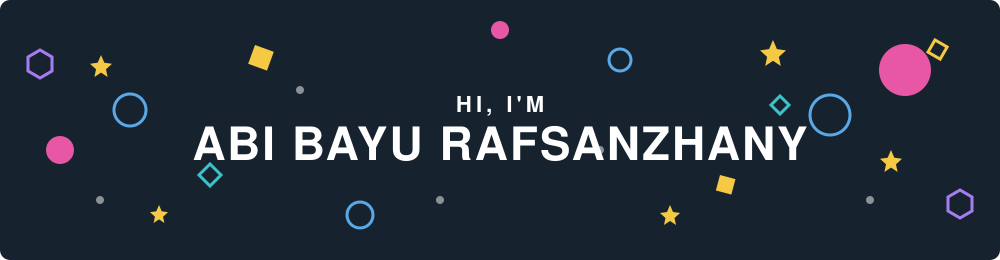

<div align="center">



</div>

<div align="center">

<a href="https://instagram.com/abbayur_">
  
</a>
<a href="mailto:abibayurafsanzhany@gmail.com">
  
</a>
<br></br>


</div>

---

## 👋 About Me:

```yaml
usnrname: abbayur_
role: Developer exploring web, mobile, machine learning
status: -
mood: curious 🌱
```

---

## 🗃️ Tech Stack:

<div align="center">
  <br />
  <a href="https://skillicons.dev">
    
  </a>
</div>

---

## 📈 GitHub Stats:

<div align="center">
  <picture>
    <source media="(prefers-color-scheme: dark)" srcset="https://streak-stats.demolab.com?user=Abi476&theme=nightowl&hide_border=true&background=0D1117" />
    <source media="(prefers-color-scheme: light)" srcset="https://streak-stats.demolab.com?user=Abi476&theme=default&hide_border=true" />
    
  </picture>
</div>

---

## 👾 Contribution Graph

<div align="center">
  <picture>
    <source media="(prefers-color-scheme: dark)" srcset="https://raw.githubusercontent.com/Abi476/Abi476/output/pacman-contribution-graph-dark.svg" />
    <source media="(prefers-color-scheme: light)" srcset="https://raw.githubusercontent.com/Abi476/Abi476/output/pacman-contribution-graph.svg" />
    
  </picture>
</div>

---

<div align="center">

</div>
